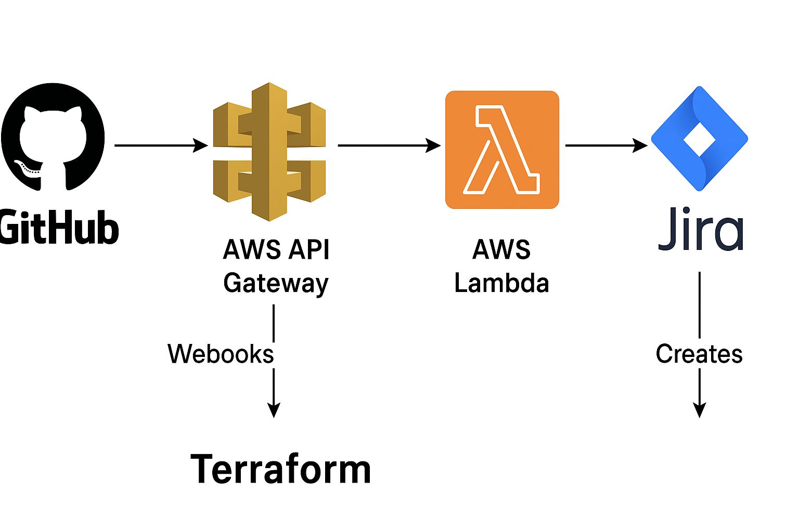

# GitHub → Jira integration (Terraform module)

[](https://github.com/gc-ghub/project-terraform-module-for-github-jira-integration-with-aws-lambda/actions) [](LICENSE)

Lightweight Terraform configuration and supporting code to deploy an integration that creates Jira issues from GitHub issue comments. The integration runs a containerized Flask application as an AWS Lambda function, exposed via API Gateway. Jira credentials are stored in AWS Secrets Manager and images are pushed to Amazon ECR.

Key behaviour: when a GitHub issue comment contains the command `/createjira`, the webhook will POST to the API Gateway endpoint which invokes the Lambda to create a Jira ticket.

## Table of Contents

- [Features](#features)
- [Architecture](#architecture-high-level)
- [Repository layout](#repository-layout)
- [Prerequisites](#prerequisites)
- [Quick start](#quick-start--deploy-with-terraform)
- [Example terraform.tfvars](#example-terraformtfvars)
- [Important variables](#important-variables-examples)
- [Outputs](#outputs)
- [Jira credentials (Secrets Manager)](#jira-credentials-secrets-manager)
- [Build & push (optional)](#build--push-the-lambda-container-image-manual)
- [Configure GitHub webhook](#configure-the-github-webhook)
- [Troubleshooting](#troubleshooting)
- [Cleanup](#cleanup)
- [Contributing & next steps](#contributing--next-steps)

## Features

- Containerized Flask app deployed to AWS Lambda (images stored in ECR)
- API Gateway endpoint to receive GitHub webhooks
- Secure storage of Jira credentials in AWS Secrets Manager
- Terraform-managed infrastructure

## Architecture (high-level)

GitHub Webhook → API Gateway → Lambda (Flask container) → Jira REST API

Secrets: AWS Secrets Manager (email + API token)

### Architecture diagram



## Repository layout

Files you will commonly use:

- `main.tf` — core Terraform resources
- `variables.tf` — input variables and defaults
- `outputs.tf` — exported outputs (API URL, lambda name, etc.)
- `provider.tf` — AWS provider configuration
- `lambda.tf`, `ecr.tf`, `iam.tf`, `api_gateway.tf` — resource-specific Terraform files
- `app.py` — Flask application implementing the webhook handler
- `Dockerfile` — builds the container image for Lambda
- `requirements.txt` — Python dependencies for the app
- `readme.md` — this file

> Tip: inspect `variables.tf` to see the full list of configurable inputs and their defaults.

## Prerequisites

- An AWS account with permissions to create Lambda, ECR, API Gateway, IAM, and Secrets Manager resources
- Terraform v1.5+ installed locally
- Docker (to build Lambda container images) if you plan to build locally
- Jira Cloud account with an API token (email + API token) and a project key
- Admin access to the target GitHub repository to configure webhooks

## Quick start — deploy with Terraform

1. Clone the repository and change into it:

    ```powershell
    git clone https://github.com/gc-ghub/project-terraform-module-for-github-jira-integration-with-aws-lambda.git
    cd project-terraform-module-for-github-jira-integration-with-aws-lambda
    ```

2. Review and set variables.

   Create a `terraform.tfvars` file or pass variables on the CLI. Example `terraform.tfvars` is shown below.

3. Initialize and apply Terraform:

    ```powershell
    terraform init
    terraform apply
    ```

   Confirm the apply with `yes` when prompted.

   After a successful apply you will see output values such as the API invoke URL.

## Example terraform.tfvars

Create a file named `terraform.tfvars` (do not commit secrets) with values similar to:

```hcl
region           = "ap-south-1"
lambda_name      = "github-to-jira-lambda"
lambda_image_tag = "latest"
# If you want Terraform to create the Jira secret, set create_secret = true
# create_secret = true
# jira_secret_arn = "arn:aws:secretsmanager:..." # if you pre-created the secret
jira_issues_url  = "https://your-domain.atlassian.net/rest/api/3/issue"
```

## Important variables (examples)

Refer to `variables.tf` for the canonical list. Common inputs:

- `region` — AWS region (example: `ap-south-1`)
- `lambda_name` — name for the Lambda function
- `lambda_image_tag` — container image tag (default: `latest`)
- `jira_issues_url` — Jira REST API endpoint for creating issues
- `create_secret` — boolean: whether Terraform should create a Secrets Manager secret for Jira credentials

If you change names/tags, re-run `terraform apply` to update the infrastructure.

## Outputs

Key outputs exported by the Terraform config:

- `api_invoke_url` — the API Gateway endpoint to configure as the GitHub webhook payload URL
- `lambda_name` — the deployed Lambda function name

Use `terraform output` to view them after apply.

## Jira credentials (Secrets Manager)

If you let Terraform create the secret (`create_secret = true`) or you create it manually, the secret should contain JSON with these keys:

```json
{
  "email": "your-jira-email@example.com",
  "api_token": "your-jira-api-token"
}
```

Store the secret name or ARN in the Terraform variables (check `variables.tf` for the variable name used).

## Build & push the Lambda container image (manual)

The repo includes a `Dockerfile` and `app.py`. To build and push the image to ECR manually (optional), the general steps are:

1. Authenticate with ECR (example uses AWS CLI):

    ```powershell
    aws ecr get-login-password --region <region> | docker login --username AWS --password-stdin <account-id>.dkr.ecr.<region>.amazonaws.com
    ```

2. Build and tag the image:

    ```powershell
    docker build -t <ecr-repo-name>:<tag> .
    docker tag <ecr-repo-name>:<tag> <account-id>.dkr.ecr.<region>.amazonaws.com/<ecr-repo-name>:<tag>
    ```

3. Push to ECR:

    ```powershell
    docker push <account-id>.dkr.ecr.<region>.amazonaws.com/<ecr-repo-name>:<tag>
    ```

    Note: The Terraform configuration may automate image building/pushing — inspect `ecr.tf` / `build.tf` to confirm how image names and tags are managed.

## Configure the GitHub webhook

In your GitHub repository settings → Webhooks → Add webhook:

- Payload URL: the `api_invoke_url` Terraform output
- Content type: `application/json`
- Which events would you like to trigger this webhook?: select `Let me select individual events` → `Issue comments`

Save the webhook. When someone posts a comment with the exact text `/createjira` on an issue, the Lambda will be invoked and a Jira ticket should be created.

## Troubleshooting

- If webhook deliveries fail in GitHub: check API Gateway logs and CloudWatch for Lambda errors.
- If Jira returns authentication errors: verify the secret contains the correct email and API token and that the token has the right permissions.
- If image deploy fails: make sure ECR repo exists and the image tag matches what Terraform expects.

## Cleanup

To destroy all resources created by Terraform:

```powershell
terraform destroy
```

## Contributing & next steps

- Add a CI/CD workflow (GitHub Actions) to build/push the container image and run `terraform apply` in a controlled pipeline.
- Add environment examples (dev/stage/prod) and improve payload customization for Jira issues (labels, assignee, priority).

## License

This project does not include a license file. Add a `LICENSE` if you want to make reuse terms explicit.

